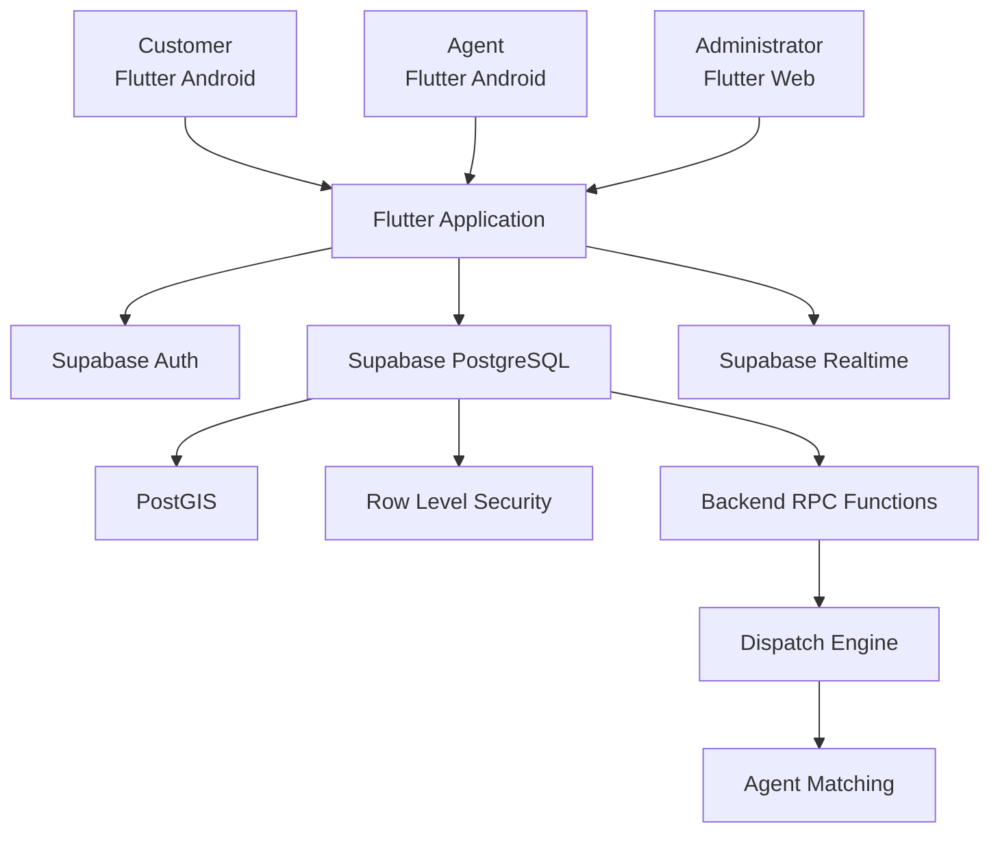

```{=html}
<p align="center">
```
``{=html}
```{=html}
</p>
```
```{=html}
<p align="center">
```
``{=html}
```{=html}
</p>
```
# ⚡ QuickServe

### A simple, reliable way to request, assign, track, and complete local services.

**Customer → Request → Smart Dispatch → Agent → Completion**

QuickServe is a full-stack service management platform built with
Flutter and Supabase. Customers create service requests, field service
agents manage and complete jobs, and administrators maintain operational
control from a web portal.

```{=html}
<p align="center">
```
``{=html}
``{=html}
``{=html}
``{=html}
``{=html}
``{=html}
``{=html}
``{=html}
```{=html}
</p>
```

------------------------------------------------------------------------

## 📌 Table of Contents

-   [Overview](#-overview)
-   [Why QuickServe?](#-why-quickserve)
-   [How It Works](#-how-it-works)
-   [Features](#-features)
-   [Request Lifecycle](#-request-lifecycle)
-   [Smart Dispatch](#-smart-dispatch)
-   [Real-Time Location & Privacy](#-real-time-location--privacy)
-   [Architecture](#-architecture)
-   [Technology Stack](#-technology-stack)
-   [Database](#-database)
-   [Security](#-security)
-   [Screens / Visuals](#-screens--visuals)
-   [Hosting](#-hosting)
-   [Getting Started](#-getting-started)
-   [Testing](#-testing)
-   [Demo Credentials](#-demo-credentials)
-   [Documentation](#-documentation)
-   [Project Structure](#-project-structure)
-   [Future Improvements](#-future-improvements)

------------------------------------------------------------------------

## ✦ Overview

QuickServe is an end-to-end **service request and dispatch platform**
for everyday local services.

Instead of requiring customers to make phone calls, wait without
updates, or face unpredictable dispatch, QuickServe turns service
delivery into a connected, transparent workflow.

Supported Service Categories:

-   ❄️ **AC Servicing**
-   🔧 **Plumbing**
-   ⚡ **Electrical**
-   🧹 **Cleaning**

Every request is stored securely, matched with an eligible service agent
using spatial proximity and availability, and tracked in real time until
completion.

-   **Customers**: Request, schedule, and track services from their
    mobile app.
-   **Service Agents**: Receive, accept, and fulfill jobs from their
    field mobile app.
-   **Administrators**: Control requests, agents, customers, and
    operational assignments via the web portal.

> **Key Principle:** *The app handles the experience. The backend
> remains the authority.*

Authentication, authorization, dispatch, assignment, and state
transitions are enforced by Supabase database policies (RLS) and
PostgreSQL RPCs rather than trusting client state.

------------------------------------------------------------------------

## ✦ Why QuickServe?

Finding a qualified service provider is only step one. A real-world
operational service platform must also manage:

-   Agent availability and operational radius
-   Automated candidate dispatch with response windows
-   Live status tracking and location privacy
-   Operational payment recording
-   Multi-role permission boundaries

QuickServe models a service request as a continuous lifecycle:

``` text
Create → Dispatch → Offer → Accept → Start → Complete
```

This structure gives customers visibility, agents a streamlined
workflow, and administrators operational oversight.

------------------------------------------------------------------------

## ✦ How It Works

``` text
                     QUICKSERVE
                          │
             ┌────────────┼────────────┐
             │            │            │
             ▼            ▼            ▼
         CUSTOMER       AGENT        ADMIN
          Mobile        Mobile        Web
             │            │            │
             └────────────┼────────────┘
                          │
                          ▼
                      SUPABASE
             ┌────────────┼────────────┐
             │            │            │
            Auth       PostgreSQL   Realtime
                         + PostGIS
             │            │            │
             └────────────┼────────────┘
                          │
                          ▼
                    Smart Dispatch
```

### 1. Request Creation

The customer picks a service, fills out details, specifies an address
with map coordinates, sets a preferred date/time, and chooses priority.

Every request generates a tracking code such as:

`REQ-2026-000123`

### 2. Backend Agent Selection

The backend spatial engine evaluates eligible candidates based on:

-   Agent availability and verification
-   Distance within the configured radius (`10 km – 20 km`, default
    `15 km`)
-   Capability matching for the requested service
-   Current workload balancing

### 3. Agent Offer Window

When a candidate is identified, a temporary offer is created with a
response window of approximately **120 seconds**. Supabase Realtime
pushes relevant offer changes to the agent's screen. If an offer is
rejected or expires, the dispatch workflow can continue to another
eligible candidate.

------------------------------------------------------------------------

## ✦ Features

### 👤 Customer Features

-   **Account Management**: Register, sign in, update profile.
-   **Service Request**: Category selection, detailed description,
    priority, scheduled date/time, location.
-   **Tracking & History**: Live status updates, active-agent tracking
    when permitted, request history.
-   **Cancellation & Payment**: Cancel eligible requests and view
    recorded payment details.

### 🛠️ Service Agent Features

-   **Field Management**: Sign in, toggle availability, adjust service
    radius (`10–20 km`), GPS readiness indicator.
-   **Dispatch Offers**: Receive real-time job offers with countdown,
    accept or reject.
-   **Job Execution**: Start service, update status, add completion
    notes, and complete jobs.
-   **Payment & History**: Record cash/UPI/other payment information and
    view job history.

### 👑 Administrator Features

-   **Web Dashboard**: Platform metrics and operational request views.
-   **Entity Management**: Customer and agent views.
-   **Manual Assignment**: Secure manual assignment through protected
    database RPCs.
-   **Request Operations**: Inspect requests, assignments, statuses,
    payments, and operational information.

------------------------------------------------------------------------

## ✦ Request Lifecycle

QuickServe enforces controlled request state transitions:

``` text
┌──────────┐
│ PENDING  │
└────┬─────┘
     │
     ▼
┌──────────────┐
│ DISPATCHING  │
└────┬─────────┘
     │
     ▼
┌──────────┐
│ ASSIGNED │
└────┬─────┘
     │
     ▼
┌─────────────┐
│ IN_PROGRESS │
└────┬────────┘
     │
     ▼
┌───────────┐
│ COMPLETED │
└───────────┘
```

Eligible requests may also be cancelled.

-   Terminal states (`COMPLETED`, `CANCELLED`) are protected from
    accidental reassignment.
-   Assignment state and request state are tracked separately.

------------------------------------------------------------------------

## ✦ Smart Dispatch

Dispatch logic runs server-side to maintain authoritative eligibility
and protect against race conditions:

``` text
Workload Check
      │
      ▼
Spatial Proximity (PostGIS)
      │
      ▼
Deterministic Agent ID Ranking
      │
      ▼
Temporary Offer
```

-   **PostGIS Spatial Queries**: Uses `ST_DWithin` with geography data
    to match request locations against eligible agent coordinates.
-   **Eligibility**: Availability, verification, service capability,
    current location, and configured radius.
-   **Candidate Ordering**: Workload ascending, distance ascending, then
    deterministic agent ID tie-breaker.
-   **Concurrency Control**: Database locking with
    `FOR UPDATE SKIP LOCKED` helps prevent concurrent dispatch
    operations from reserving the same candidate incorrectly.
-   **Offer Expiry**: Offers use an approximately 120-second response
    window.

------------------------------------------------------------------------

## ✦ Real-Time Location & Privacy

QuickServe balances operational real-time tracking with strict privacy
rules:

``` text
Offer Pending / Not Accepted
      │
      ▼
Customer Tracking Disabled
      │
      ▼
Agent Accepts / Active Job
      │
      ▼
Authorized Live GPS Tracking
      │
      ▼
Job Completed / Cancelled
      │
      ▼
Live Tracking Access Ends
```

-   Device GPS is used during active service workflows.
-   Customers do not receive unrestricted agent location access.
-   Unlimited historical GPS tracking is intentionally excluded.
-   Agent operational location is controlled through backend
    authorization and request state.

------------------------------------------------------------------------

## ✦ Architecture



### Architecture Layers

  -----------------------------------------------------------------------
  Layer                   Technology              Responsibility
  ----------------------- ----------------------- -----------------------
  **Mobile App**          Flutter                 Customer and Agent
                                                  Android applications

  **Web Portal**          Flutter Web             Admin operations
                                                  dashboard

  **State Management**    Riverpod                Reactive application
                                                  state and dependency
                                                  management

  **Navigation**          go_router               Declarative, role-aware
                                                  navigation

  **Maps & Location**     flutter_map +           Map UI and device GPS
                          OpenStreetMap +         
                          Geolocator              

  **Authentication**      Supabase Auth           User identity and
                                                  session management

  **Database & Spatial**  PostgreSQL + PostGIS    Relational data and
                                                  geospatial operations

  **Security & Logic**    Supabase RLS +          Database authorization
                          PostgreSQL RPCs         and backend business
                                                  logic

  **Realtime Engine**     Supabase Realtime       Live offers and status
                                                  updates

  **Web Hosting**         Firebase Hosting        Hosting for the Flutter
                                                  Web application
  -----------------------------------------------------------------------

------------------------------------------------------------------------

## ✦ Technology Stack

### Frontend

-   **Flutter & Dart**: Cross-platform application framework
-   **Riverpod**: State management and dependency injection
-   **go_router**: Routing and navigation guards
-   **flutter_map**: Open-source map integration
-   **Geolocator**: Device location

### Backend & Database

-   **Supabase**: Backend platform
-   **PostgreSQL**: Primary relational database
-   **PostGIS**: Geographic objects and spatial operations
-   **Supabase Auth**: Authentication and session management
-   **Supabase Realtime**: Live database updates
-   **PostgreSQL RLS**: Fine-grained database authorization
-   **PostgreSQL RPCs**: Protected business operations and dispatch
    logic

### Infrastructure & Hosting

-   **Firebase Hosting**: Static SPA hosting for Flutter Web
-   **GitHub**: Version control and source repository

------------------------------------------------------------------------

## ✦ Database

The database is built around relational integrity and spatial data:

``` text
┌─────────────┐
│   profiles  │
└──────┬──────┘
       │
       ├───────────────┐
       │               │
       ▼               ▼
┌──────────────┐  ┌────────────────┐
│agent_profiles│  │service_requests│
└──────────────┘  └───────┬────────┘
                           │
                           ▼
                  ┌──────────────────┐
                  │service_assignments│
                  └─────────┬────────┘
                            │
              ┌─────────────┼─────────────┐
              ▼             ▼             ▼
       request history   locations     payments
```

### Core Tables

-   `profiles`: Core user record linked to `auth.users` with role
    identifiers (`customer`, `agent`, `admin`).
-   `agent_profiles`: Agent operational availability, service radius,
    verification, and agent-specific information.
-   `service_requests`: Customer requests, lifecycle status, service
    details, and geographic location.
-   `service_assignments`: Agent/request relationships, offer state,
    assignment state, and timestamps.
-   `agent_locations`: Current operational agent GPS positions using
    PostGIS geography.
-   `payments`: Payment records including amount, currency, method,
    status, and timestamps.
-   `request_status_history`: Request state transition history.

Detailed database documentation: [docs/DATABASE.md](docs/DATABASE.md)

------------------------------------------------------------------------

## ✦ Security

### 1. Backend Authorization & RLS

Client-side role representations are treated as UI state only. Database
operations are protected by Row Level Security policies and backend
authorization checks.

``` text
Flutter
   │
   ▼
Supabase Auth
   │
   ▼
Authenticated Session
   │
   ▼
PostgreSQL RLS / RPC Authorization
```

### 2. Protected Administrative RPCs

Critical administrative operations such as manual agent assignment
execute through protected functions such as
`admin_assign_service_request()`, which validates the authenticated
user's role before performing the operation.

### 3. Client Role Spoofing Prevention

During physical-device testing, a development-only client-side role
switcher was identified as a source of UI/backend role desynchronization
and removed.

The authoritative role flow is:

``` text
Supabase Auth
      ↓
public.profiles
      ↓
Authoritative Role
      ↓
Flutter Auth State
      ↓
UI / Route Access
```

### 4. Credential & Environment Protection

-   Only public client configuration (`SUPABASE_URL` and public
    anon/publishable key) is used in the Flutter application.
-   Service-role keys, database passwords, and private secrets are never
    placed in the client.
-   `.env` is excluded from Git.
-   `.env.example` contains only safe configuration placeholders.

Detailed security documentation: [docs/SECURITY.md](docs/SECURITY.md)

------------------------------------------------------------------------

## ✦ Screens / Visuals

The repository contains the QuickServe visual assets and product
showcase under:

``` text
docs/assets/
```

The main animated and static product showcases are:

-   `quickserve-hero.gif`
-   `quickserve-hero.png`

Recommended application screenshots can also be added under
`docs/assets/` without changing the application architecture.

------------------------------------------------------------------------

## ✦ Hosting

QuickServe Flutter Web is configured for **Firebase Hosting**.

``` text
Flutter Web
    │
    ▼
Firebase Hosting
    │
    ▼
QuickServe Web Admin Portal
    │
    ▼
Supabase
```

-   **Frontend**: Firebase Hosting serves the Flutter Web single-page
    application.
-   **Backend**: Supabase remains responsible for authentication,
    PostgreSQL, PostGIS, RLS, RPCs, and Realtime.
-   Firebase is used only for web hosting; the Flutter application does
    not use Firebase as its application backend.

### Build Web

``` bash
flutter build web --release
```

### Firebase Hosting

After Firebase CLI authentication and project configuration:

``` bash
firebase login
firebase init hosting
firebase deploy --only hosting
```

For Flutter Web, configure the Firebase Hosting public directory as:

``` text
build/web
```

and enable the SPA rewrite to:

``` text
/index.html
```

Detailed deployment instructions: [docs/HOSTING.md](docs/HOSTING.md)

------------------------------------------------------------------------

## ✦ Getting Started

### 1. Prerequisites

Install:

-   Flutter SDK **3.47.5** or a compatible Flutter 3.x release
-   Dart SDK bundled with Flutter
-   Android Studio / Android SDK for Android development
-   Git
-   A configured Supabase project

Verify the environment:

``` bash
flutter --version
flutter doctor
```

Expected project baseline:

``` text
Flutter 3.47.5
Dart 3.13.4
```

### 2. Clone Repository

``` bash
git clone https://github.com/pranav122005/Quickserve.git
cd Quickserve
```

### 3. Install Dependencies

``` bash
flutter pub get
```

### 4. Environment Configuration

Create the local environment configuration from `.env.example`.

Use the public Supabase project URL and public anon/publishable key:

``` text
SUPABASE_URL
SUPABASE_ANON_KEY
```

Never add:

``` text
SUPABASE_SERVICE_ROLE_KEY
DATABASE_PASSWORD
PRIVATE_API_KEYS
```

to the Flutter client or Git repository.

### 5. Supabase Backend

The application requires the configured Supabase backend with:

-   Supabase Auth
-   PostgreSQL
-   PostGIS
-   RLS policies
-   Dispatch/assignment RPCs
-   Required database indexes
-   Realtime configuration

Apply the project's existing migrations when setting up a new
development environment.

### 6. Run Web Admin Portal

``` bash
flutter run -d chrome
```

The web application provides the administrative portal and responsive
operational views.

### 7. Run Android Application

Check available devices:

``` bash
flutter devices
```

Then run:

``` bash
flutter run
```

For a specific device:

``` bash
flutter run -d <device-id>
```

### 8. Build Android Release APK

``` bash
flutter build apk --release
```

The release APK is generated under:

``` text
build/app/outputs/flutter-apk/app-release.apk
```

### 9. Build Flutter Web

``` bash
flutter build web --release
```

The production web bundle is generated under:

``` text
build/web/
```

------------------------------------------------------------------------

## ✦ Testing

QuickServe includes unit, widget, and architecture/security-oriented
tests covering core application behavior.

Run static analysis:

``` bash
flutter analyze
```

Run the test suite:

``` bash
flutter test
```

### Current Verification Baseline

``` text
Flutter Analyze
0 issues

Flutter Tests
83 / 83 passing

Android
Release APK built successfully

Physical Device
Motorola Edge 70 Fusion
Android 16
```

The physical-device verification included authentication, Admin role
verification, fresh request creation, Admin agent assignment, backend
assignment RPC execution, Agent offer visibility, and Agent offer
acceptance.

### Recommended E2E Flow

``` text
Customer Login
        ↓
Create Request
        ↓
Backend Dispatch
        ↓
Agent Offer
        ↓
Agent Accept
        ↓
Assigned
        ↓
Agent Start
        ↓
In Progress
        ↓
Agent Complete
        ↓
Completed
        ↓
Payment Record
        ↓
Admin Verification
```

Complete testing and walkthrough details: [docs/DEMO.md](docs/DEMO.md)

------------------------------------------------------------------------

## ✦ Demo Credentials

The following dedicated accounts are intended for demonstration/testing
of the three application roles.

  ----------------------------------------------------------------------------------
  Role              Email                       Password           Interface
  ----------------- --------------------------- ------------------ -----------------
  **Customer**      `customer@quickserve.com`   `QuickServe@123`   Android

  **Agent**         `agent@quickserve.com`      `QuickServe@123`   Android

  **Admin**         `admin@quickserve.com`      `QuickServe@123`   Flutter Web
  ----------------------------------------------------------------------------------

> These are demonstration credentials only. Do not reuse them for
> production accounts.

------------------------------------------------------------------------

## ✦ Documentation

Comprehensive documentation files are located in the `docs/` directory:

-   🏗️ [Architecture Guide](docs/ARCHITECTURE.md) --- System
    architecture, component models, and data flows.
-   🗄️ [Database Schema](docs/DATABASE.md) --- Tables, functions, RLS
    policies, and PostGIS setup.
-   🔒 [Security Policy](docs/SECURITY.md) --- RLS model, role
    enforcement, authorization and security hardening.
-   🧪 [Demo & Testing Guide](docs/DEMO.md) --- Test breakdown, demo
    steps, and device verification.
-   🌐 [Hosting Guide](docs/HOSTING.md) --- Web build and Firebase
    Hosting configuration.

------------------------------------------------------------------------

## ✦ Project Structure

``` text
Quickserve/
├── android/                   # Android native configuration & launcher icons
├── ios/                       # iOS native platform configuration
├── web/                       # Web entry points & index.html
├── lib/                       # Application source code
│   ├── core/                  # Shared utilities, configuration, theme, routing
│   ├── data/                  # Data/repository implementations
│   └── features/              # Feature modules
│       ├── auth/
│       ├── customer/
│       ├── agent/
│       └── admin/
├── test/                      # Unit, widget, and architecture/security tests
├── supabase/                  # Database migrations and backend configuration
│   └── migrations/
├── docs/                      # Technical documentation & project assets
│   ├── assets/
│   │   ├── quickserve-logo.jpg
│   │   ├── quickserve-hero.png
│   │   └── quickserve-hero.gif
│   ├── ARCHITECTURE.md
│   ├── DATABASE.md
│   ├── DEMO.md
│   ├── HOSTING.md
│   └── SECURITY.md
├── .env.example               # Safe environment configuration template
├── .gitignore                 # Ignored files and build artifacts
├── firebase.json              # Firebase Hosting configuration
├── pubspec.yaml               # Flutter dependencies
└── README.md                  # Main project documentation
```

------------------------------------------------------------------------

## ✦ Future Improvements

Planned enhancements for future releases:

-   Push notifications via FCM / Web Push
-   Multi-provider OAuth (Google / Apple Sign-In)
-   Customer ratings and agent feedback system
-   Automated payment gateway integration
-   Route optimization for field agents
-   Extended analytics and observability
-   Broader CI/CD automation

------------------------------------------------------------------------

## ✦ SWASIQ Technical Assignment

QuickServe was developed as part of the **SWASIQ Technology Internship
Program --- Full-Stack Mobile Application Technical Assignment**.

The implementation covers the requested end-to-end workflow:

``` text
Customer
   │
   │ Create Request
   ▼
Service Request
   │
   ▼
Smart Dispatch
   │
   ▼
Service Agent
   │
   ├── Accept
   ├── Start
   └── Complete
   │
   ▼
Completed Request
```

### Assignment Coverage

  -----------------------------------------------------------------------
  Requirement                         Implementation
  ----------------------------------- -----------------------------------
  Flutter mobile application          Flutter Android

  Web administration portal           Flutter Web

  Backend                             Supabase

  Authentication                      Supabase Auth

  Roles                               Customer / Agent / Admin

  Authorization                       PostgreSQL RLS + protected RPCs

  Database                            PostgreSQL

  Spatial dispatch                    PostGIS

  Realtime                            Supabase Realtime

  Services                            AC Servicing / Plumbing /
                                      Electrical / Cleaning

  Request lifecycle                   Pending → Dispatching → Assigned →
                                      In Progress → Completed

  Agent assignment                    Smart dispatch + Admin manual
                                      assignment

  Location                            Device GPS + PostGIS

  Payment                             Operational payment recording

  Request history                     Request status history

  Error handling                      Centralized application error
                                      handling

  Testing                             Flutter unit/widget/architecture
                                      tests

  Documentation                       README + Architecture + Database +
                                      Security + Demo + Hosting
  -----------------------------------------------------------------------

### Submission Repository

**GitHub:**\
https://github.com/pranav122005/Quickserve

The repository contains the application source, setup instructions,
architecture/security documentation, testing information, and
demonstration credentials required for technical review.

------------------------------------------------------------------------

## ✦ Brand & License

```{=html}
<p align="center">
```
``{=html}`<br>`{=html}
`<strong>`{=html}QuickServe`</strong>`{=html}`<br>`{=html}
`<em>`{=html}Request it. Dispatch it. Complete it.`</em>`{=html}
```{=html}
</p>
```

------------------------------------------------------------------------

```{=html}
<p align="center">
```
`<strong>`{=html}Built with Flutter +
Supabase`</strong>`{=html}`<br>`{=html} Making local service operations
simpler, faster, and more connected.
```{=html}
</p>
```
